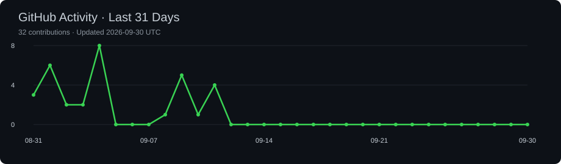

Full Stack Developer 🔧 & PM 🧠

Currently attempting to make a lightsaber ⚔️✨.

  

<!---
GeekyWizKid/GeekyWizKid is a ✨ special ✨ repository because its `README.md` (this file) appears on your GitHub profile.
You can click the Preview link to take a look at your changes.
--->

